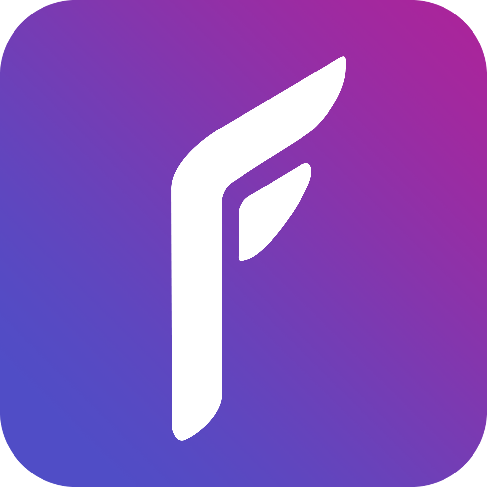

#  FERRUM


# POWERED BY
Ferrum is created by using Termux, Termux:API, Termux:Widget, spotDL and F-droid.
 - F-Droid is used to download all termux related apps (Termux, API, Widget).
 - SpotDL does the heavy lifting when it comes to fetching, tagging with metadata and downloading songs from a link.
 
| |||||
|--------|------------|------------|---------------|--------|
| [Spotdl](https://github.com/spotDL/spotify-downloader) | [Termux:APP](https://github.com/termux/termux-app) | [Termux:API](https://github.com/termux/termux-api) | [Termux:Widget](https://github.com/termux/termux-widget)  | [F-droid](https://github.com/f-droid/fdroidclient) |

# Installation

  ## Pre Requisites
   - Install Fdroid
   - Install Termux, Termux:API, Termux:Widget from F-droid
   - Give permissions to termux; Open termux and execute (Write + Enter)
   ```
    termux-setup-storage
   ```
  ## Downloading the Ferrum setup script & execution

  - Copy and paste this command in your termux terminal:
  ```sh
  curl https://raw.githubusercontent.com/Jnv821/FERRUM/main/Ferrum-Setup.sh > Ferrum-Setup.sh ; chmod +x Ferrum-Setup.sh ; source Ferrum-Setup.sh
  ```
  - The script will ask for input 3 times, you can go ahead and press enter to ignore these prompts. These are not important just a byproduct of the `Ferrum-Setup.sh` script.
  - Ferrum is now installed, you can go to your home screen and add a Termux Widget, select ``tasks/Ferrum.sh`` and you will have the ferrum graphical interface for Spotdl installed.
  
# Default Options of Ferrum
 - Output Format: **mp3**
 - Path template: **'{artist}/{Album}/{title} - {artist}.{ext}'** (This is how your files get named & set up in specific folders.)
 - Lyrics provider: **Genius**
 - Output path Location: **"storage/shared/Music/Ferrum/"**  (This is where your files are stored)

 *Example command of default settings on ferrum:*
```
spotdl *LINK* --output-format --path-template '{artist}/{Album}/{title} - {artist}.{ext}' --lyrics-provider genius -o "storage/shared/Music/FERRUM/"
```
# Changing configuration

You can change the configuration in the Ferrum graphical interface or in the configuration folder, this last option not being recommended since it can break FERRUM

## File formats:

You can change this going to options -> file format

These are the file formats availables:
 - mp3
 - m4a
 - flac
 - opus
 - ogg
 - wav

## Lyrics Provider

You can change this going to options -> Lyrics provider

These are the lyrics provider currently available

 - Genius
 - Musixmatch

## Advanced configuration
  We do not reccomend changing the **Path Template** and **Output Path** options if you don't have terminal / json experience, since it may require you edit this type of files if something goes wrong. 
  
  ### Changing Path template:
  **to change path template is important that your path template is between " "** , if not FERRUM will stop working correctly. You have the following options to define your path template:
  
   - {artist} : Name of the artist
   - {artists} : Name of the artists
   - {title} : Title of the track
   - {album} : Name of the Album
   - {ext}  : File extension
   - {playlist} : Name of the playlist 
   
  Lets add an example with this song: 
  
<p align="center"><a href="https://www.youtube.com/watch?v=iFBic5SN0nM"></a></p>

### Example 1

Using the default settings the path where the song would be downloaded is the following:
```
option:
{artist}/{album}/{title} - {artist}.{ext}

output:
../FERRUM/YUJU/[REC]/Blue Nostalgia - Yuju.mp3
..
 ╚FERRUM
       ╚ YUJU
           ╚ [REC]
                ╚ Blue Nostalgia - YUJU.mp3
             
```
### Example 2
Let's see another example with the same song:
```
option:{artist}/{artist} - {title}.{ext}

output:
../FERRUM/YUJU/YUJU - Blue Nostalgia.mp3

..
 ╚ FERRUM
        ╚ YUJU
             ╚ YUJU - Blue Nostalgia.mp3
```

### Changing path output

To change the path output to a specific folder its is **required** that is **between " "** and starts with 

```
storage/shared/...
```

After that you can specify the folder you want, if the folder is not created spotDL will create it for you.  We reccomend that you leave this option unchanged since it can break FERRUM. 

### Example 1: 
- This is the default for FERRUM
```
Option: storage/shared/Music/Ferrum/
```
- This will download all the songs to a folder called Ferrum inside Music in your internal storage, with the path template options as last forlders.

### Example 2:
```
Option: storage/shared/Downloads/
```
- This will download all your songs to the Downloads folder
